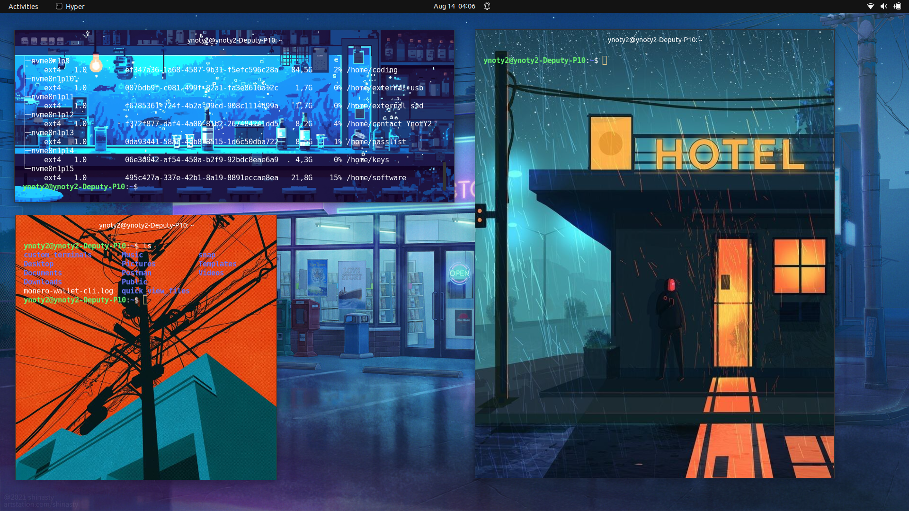
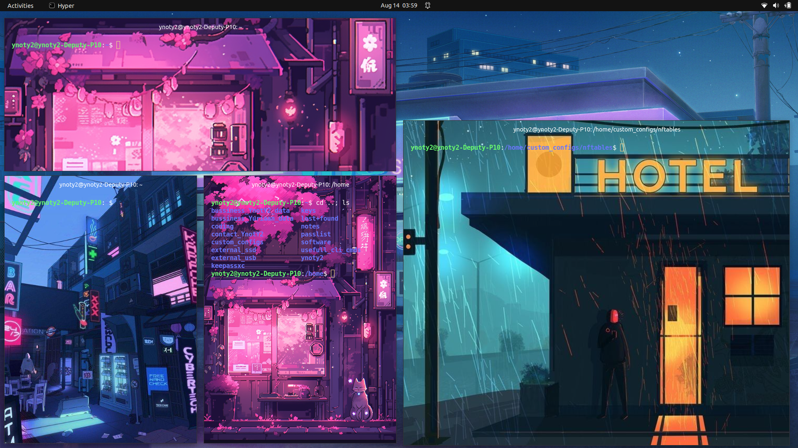
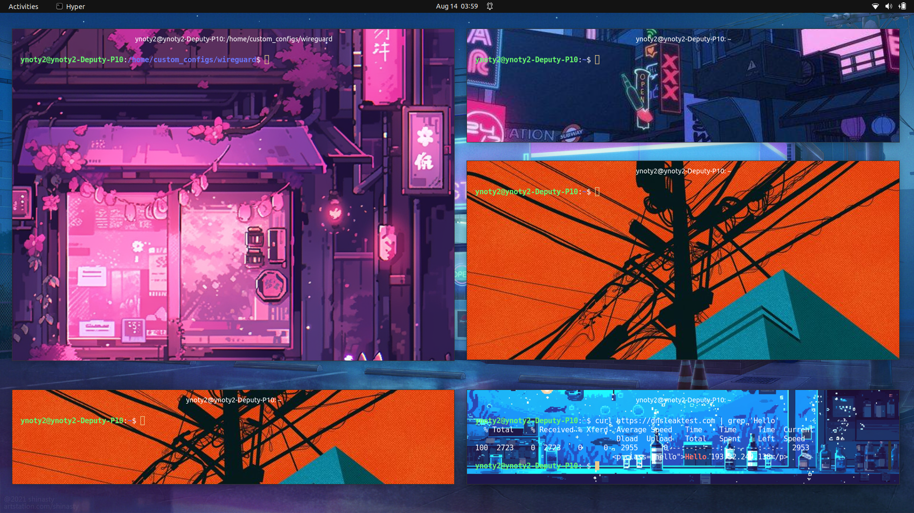

# hyper_terminals_on_startup
Open specified amount of custom hyper terminals automatically, run custom unique cli cmd within each induvidual window and move them to specified pixels on computer start-up.

# Setup Guide for Startup Terminals

This guide will help you set up a `startup_terminals.sh` script to open and configure Hyper terminals automatically when your computer starts.

## Features:
-   Create Required Directories ✅
-   Update Hyper Configuration ✅
-   Create a Cron Job for Automatic Startup terminals on boot ✅
-   Admin manegement dashboard for all available booking ✅





## Table of Contents

1. [Features](#features)

2. [Installation](#installation)
   - [Cloning Git Repository](#cloning-git-repository)
   - [Installing requirements](#installing-requirements)
   - [Getting API Key from BotFather](#getting-api-key-from-botfather)
    - [Works out of the box 📦](#works-out-of-the-box-)
        - [Configuration](#configuration)
        - [1. Update Configuration Settings](#1-update-configuration-settings)
        - [2. Update FAQ Data](#2-update-faq-data)
        - [3. Customizing Start Menu [Main-Menu]](#3-customizing-start-menu-main-menu)
        - [4. Modifying Opening Hours](#4-modifying-opening-hours)

5. [Understanding Code Layout](#understanding-code-layout)
   - [Directory Layout](#directory-layout)
   - [Summary](#summary)


When you clone the repository, it should look like this:

@```
git_hub_images
backround_images
explained.txt
hyper_configs
README.md
run_on_startup
@```


## Installation
### Cloning Git Repository
To clone Git repository using the command line, follow these simple steps:

1. Navigate to the dirctory on you're computer you wish to start coding.
2. Clone this GitHub repo:
```
git clone git@github.com:YnotY2/<public_repo_link>.git
```

<br>

### Installing requirements
To install requirements using the command line, follow these simple steps:

1. Navigate to the dir containing the 'requirements.txt' file.
2. Install the requirements:
```
pip install -r requirements.txt
```

<br>
<br>
<br>
<br>

```
backround_images, explained.txt, hyper_configs, README.md, run_on_startup
```


### File: `main.sh`

The `main.sh` script automates the process of installing Hyper, configuring it with custom settings, and setting up the startup scripts.

```bash
#!/bin/bash

# Variables
SCRIPT_DIR="/home/custom_configs/personal_computer_startup_scripts/hyper_terminal"
HYPER_CONFIG_DIR="/home/custom_configs/hyper_terminal"
BACKGROUND_IMAGES_DIR="/home/custom_configs/hyper_terminal/backround_images"
HYPER_CONFIG_FILE="./hyper_configs/hyper_custom_background.js"

# Ensure the script is run as root for package installation
if [ "$(id -u)" -ne "0" ]; then
    echo "This script requires root privileges. Please run as sudo."
    exit 1
fi

# Download and install Hyper
echo "Downloading and installing Hyper..."
curl -L https://releases.hyper.is/download/deb -o /tmp/hyper.deb
dpkg -i /tmp/hyper.deb
apt-get install -f -y  # Fix any dependency issues

# Install Hyper plugins
echo "Installing Hyper plugins..."
hyper i hyper-background
hyper i hyper-startup

# Create required directories
echo "Creating directories..."
mkdir -p "$SCRIPT_DIR"
mkdir -p "$HYPER_CONFIG_DIR"
mkdir -p "$BACKGROUND_IMAGES_DIR"

# Copy files to the appropriate directories
echo "Copying files..."
cp -r ./run_on_startup/* "$SCRIPT_DIR/"
cp -r ./backround_images/* "$BACKGROUND_IMAGES_DIR/"

# Update Hyper configuration
echo "Updating Hyper configuration..."
cp "$HYPER_CONFIG_FILE" ~/.hyper.js

# Create a cron job for automatic startup
echo "Creating cron job..."
crontab -l > /tmp/crontab_backup
if ! grep -q "reboot /home/custom_configs/personal_computer_startup_scripts/hyper_terminal/startup_terminals.sh" /tmp/crontab_backup; then
    echo "reboot /home/custom_configs/personal_computer_startup_scripts/hyper_terminal/startup_terminals.sh" >> /tmp/crontab_backup
    crontab /tmp/crontab_backup
fi
rm /tmp/crontab_backup

# Ensure script permissions
echo "Setting permissions for startup script..."
chmod +x /home/custom_configs/personal_computer_startup_scripts/hyper_terminal/startup_terminals.sh

# Test the script manually
echo "Testing startup script..."
/home/custom_configs/personal_computer_startup_scripts/hyper_terminal/startup_terminals.sh

echo "Setup completed successfully."
```

### Running the Setup

1. **Make the Script Executable:**

   Before running `main.sh`, ensure it is executable:
   ```bash
   chmod +x main.sh
   ```

2. **Run the Script with Root Privileges:**

   Execute the script with `sudo` to ensure all installation and configuration steps are performed correctly:
   ```bash
   sudo ./main.sh
   ```

By following these steps, your Hyper terminals will be set up to open and configure automatically upon startup.

For further assistance, refer to the `explained.txt` file or contact the repository maintainers.


### File: `startup_terminals.sh`

The `startup_terminals.sh` script is designed to open Hyper terminals and run commands within them each time your computer starts.

@```bash
#!/bin/bash
# This is a startup_script to open terminals and run cmds within them each time computer starts

# Change directory to the location of your batch scripts
cd /home/custom_configs/personal_computer_startup_scripts/hyper_terminal

# Execute the first batch script
./open_specified_amount_hyper_terminal_windows

# Sleep for 2 seconds so all terminals are opened
sleep 2

# Execute the second batch script
./move_and_resize_all_open_hyper_terminals

# Sleep for 2 seconds after moving all terminals
sleep 2

# Execute the third batch script
./execute_specified_cmds_within_open_hyper_terminals
@```


## Setting Up

- **Download and Install Hyper:**

     ```bash
     curl -L https://releases.hyper.is/download/deb -o hyper.deb
     sudo dpkg -i hyper.deb
     sudo apt-get install -f  # Fix any dependency issues
     ```

- **Install Plugins:**

Open a terminal and run the following commands to install the hyper-background and hyper-startup plugins:
	bash```
	hyper i hyper-background
	hyper i hyper-startup
	```

Follow these steps to correctly configure your system:

1. **Create Required Directories:**

   - Create the directory for personal startup scripts:
     @```bash
     mkdir -p /home/custom_configs/personal_computer_startup_scripts/hyper_terminal
     @```

   - Create the directory for Hyper terminal configurations:
     @```bash
     mkdir -p /home/custom_configs/hyper_terminal
     @```

   - Create the directory for background images:
     @```bash
     mkdir -p /home/custom_configs/hyper_terminal/backround_images
     @```

2. **Copy Files:**

   - Copy all files from the `./run_on_startup/` directory to `/home/custom_configs/personal_computer_startup_scripts/hyper_terminal/`:
     @```bash
     cp -r ./run_on_startup/* /home/custom_configs/personal_computer_startup_scripts/hyper_terminal/
     @```

   - Copy all files from `./backround_images/` to `/home/custom_configs/hyper_terminal/backround_images/`:
     @```bash
     cp -r ./backround_images/* /home/custom_configs/hyper_terminal/backround_images/
     @```

3. **Update Hyper Configuration:**

   - Overwrite the file content of `~/.hyper.js` with `./hyper_configs/hyper_custom_background.js`:
     @```bash
     cp ./hyper_configs/hyper_custom_background.js ~/.hyper.js
     @```

4. **Create a Cron Job for Automatic Startup:**

   - Open your crontab configuration:
     @```bash
     crontab -e
     @```

   - Add the following line to execute the `startup_terminals.sh` script at startup:
     @```bash
     @reboot /home/custom_configs/personal_computer_startup_scripts/hyper_terminal/startup_terminals.sh
     @```

   - Save and exit the editor.

## Verifying Setup

- **Ensure Script Permissions:**

  Make sure the `startup_terminals.sh` script is executable:
  @```bash
  chmod +x /home/custom_configs/personal_computer_startup_scripts/hyper_terminal/startup_terminals.sh
  @```

- **Test the Script Manually:**

  You can test the script manually to ensure it works correctly:
  @```bash
  /home/custom_configs/personal_computer_startup_scripts/hyper_terminal/startup_terminals.sh
  @```

By following these steps, your `startup_terminals.sh` script will run at startup, automatically opening and configuring your Hyper terminals as specified.

For further assistance, refer to the `explained.txt` file or contact the repository maintainers.
